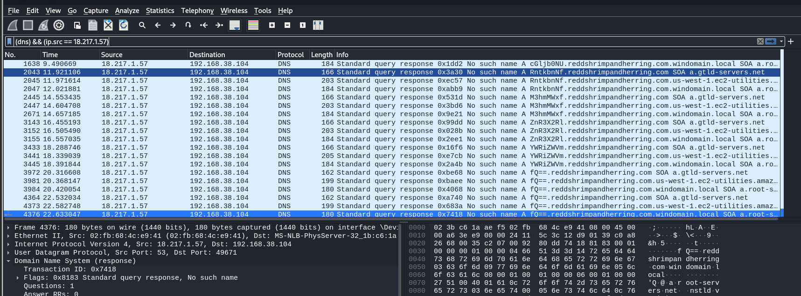
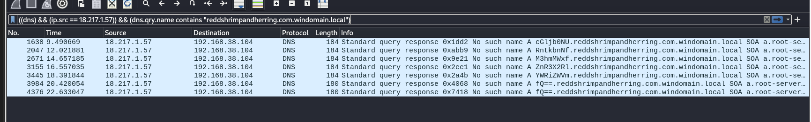

# CTF Challenge Writeup
**Name:** Wireshark twoo twooo two twoo...  
**Points:** 100  
**Category:** Forensics  

## Objective

The objective of this challenge is to extract the flag from a packet capture file using Wireshark and forensic analysis techniques.

## Solution

**Manual Way of Finding Flag**
1. **Analyzing the Packet Capture**
   - To begin the challenge, I opened the provided packet capture file in Wireshark. Upon initial inspection, I noticed a significant number of DNS packets, making up 31.1% of the traffic, and HTTP packets, accounting for 16.6%.
   - This can be done by looking at the protocol hierarchy.
   

2. **Starting with HTTP Packets**
   - I decided to start by examining the HTTP packets since I was more familiar with them. I found many variations of the flag, but it was clear that submitting them wouldn't solve the challenge. 
   

3. **Turning to DNS Packets**
   - I proceeded to the DNS packets, which presented a more challenging task. Not going to lie, my eyes was bleeding looking through the DNS packets.

4. **Identifying Base64 Encoded Message**
   - At the end of the DNS packets, I identified one end of a base64 encoded message. This discovery marked significant progress.
   

5. **Filtering by Source IP Address**
   - I then filtered the source IP address associated with this particular message. This reduced the dataset, making it more manageable. Not going to make any difference, since I FOUND THIS AT THE END OF ALL THE DNS PACKETS.
   

6. **Addressing Duplication**
   - However, a new issue arose as I noticed the duplication of the string "fQ==". To address this, I determined that the duplication occurred because the message was sent to different domains with the same prefix.
        ```
        fQ==.reddshrimpandherring.com.windomain.local
        fQ==.reddshrimpandherring.com
        fQ==.reddshrimpandherring.com.us-west-1.ec2-utilities.amazonaws.com
        ```

7. **Applying a Specialized Filter**
   - To handle the duplication, I constructed a specific filter: 
        ```
        ((dns) && (ip.src == 18.217.1.57)) && (dns.qry.name contains "reddshrimpandherring.com.windomain.local")
        ```
   - This filter helped narrow down the results.
   

8. **Dealing with Final Duplication**
   - Despite the filtering efforts, I couldn't find obvious differences to filter out the final duplicating ```fQ==```. As a result, there would be two instances in the output.

9. **Combining and Decoding Base64**
   - From this point, you should be able to combine the base64-encoded segments and decode them to reveal the flag.

**tshark solution**
1. **Using Tshark for Faster Filtering**
   - For those who want a faster approach, using `tshark` is recommended. The following command can help streamline the process:
        ```shell
        tshark -nr <pcap file> -Y '((dns) && (ip.src == 18.217.1.57)) && (dns.qry.name contains "reddshrimpandherring.com.windomain.local")' > filter.txt
        ```
**The Hard Way with Scapy**
1. Alternatively, I chose to tackle this the hard way and learned how to use Scapy. Below is the code I used:

    ```python
    from scapy.all import *
    import base64
    
    flag = ""
    
    for packet in rdpcap("shark2.pcapng"):
        if packet.haslayer(UDP):
            if packet[IP].dst == "18.217.1.57":
                string = str(packet[DNS])
                if "reddshrimpandherring.com.windomain.local." in string:
                    string = string.replace("DNS Qry \"b'", "")
                    string = string.replace(".reddshrimpandherring.com.windomain.local.'\"", "")
                    if string not in flag:
                        flag += string
    
    print(base64.b64decode(flag.replace(" ", "")).decode())
    ```
1. **`from scapy.all import *`:** This line imports all the functions and classes from the Scapy library. Scapy is a powerful tool for working with network packets and allows us to manipulate and analyze them.

2. **`import base64`**: This line imports the `base64` module, which we'll use later to decode a base64-encoded string in the code.

3. **```flag = ""```**: Here, I initialize an empty string called `flag`. This string will hold the different parts of the flag as we extract them from the network traffic.

4. **```for packet in rdpcap("shark2.pcapng")```:** This part of the code sets up a loop that goes through each packet in the PCAP file named "shark2.pcapng." We use the `rdpcap` function to read the PCAP file, and it returns a list of packet objects.

5. **`if packet.haslayer(UDP)`**: In this line, I check if the current packet has a UDP (User Datagram Protocol) layer. The focus here is on UDP packets.

6. **`if packet[IP].dst == "18.217.1.57":`**: This condition is used to filter packets based on the destination IP address of the UDP packet. If the destination IP address matches "18.217.1.57," the packet is considered.

7. **`string = str(packet[DNS]):`**: Here, I extract the DNS (Domain Name System) layer from the packet and convert it to a string. Typically, the DNS layer contains DNS queries and responses.

8. **`if "reddshrimpandherring.com.windomain.local." in string:`**: This condition checks if the string contains the specific substring "reddshrimpandherring.com.windomain.local." This particular substring is used to identify relevant DNS queries.

9. **`string = string.replace("DNS Qry \"b'", ""):`**: In this line, I remove the prefix "DNS Qry 'b'" from the string. It's assumed that the flag is encoded as a base64 string, and this prefix needs to be removed.

10. **`string = string.replace(".reddshrimpandherring.com.windomain.local.'\"", ""):`**: This line removes the suffix ".reddshrimpandherring.com.windomain.local.'" from the string. This is assumed to be part of the encoding process, so it's removed.

11. **`if string not in flag:`**: This condition checks if the modified string is not already in the `flag` string. The purpose is to prevent duplicate entries in the flag.

12. **`flag += string:`**: If the string is not a duplicate, it's added to the `flag` string, allowing us to collect the parts of the flag.

13. **`print(base64.b64decode(flag.replace(" ", "")).decode()):`**: Finally, the code prints the `flag` string after removing any spaces and decodes it using base64. This reveals the decoded flag, which was hidden within the DNS queries of the captured network traffic.


## Flag
All that effort for a 100 points challenge. heeheeheehar.

The flag for the Wireshark twoo twooo two twoo... challenge is `picoCTF{XXXXXXXXXX}`. Please replace 'XXXXXXXXXX' with the actual flag you obtained after successfully decoding the base64-encoded message.

Congratulations on completing this Forensics challenge! You've demonstrated your skills in analyzing packet captures and using both Wireshark and Scapy for forensic analysis.
