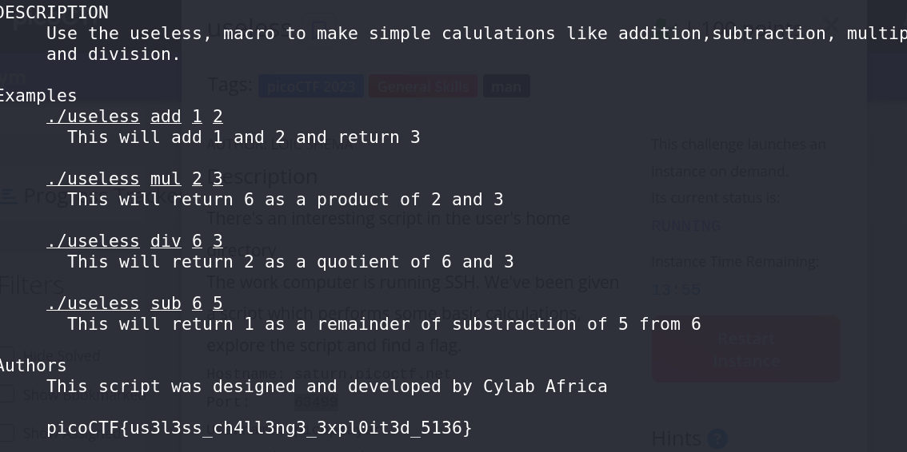

# Useless - CTF Challenge Writeup

## Challenge Information
- **Name**: Useless
- **Points**: 100
- **Category**: General Skills

## Objective
The objective of the "Useless" CTF challenge is to test your command-line skills and your ability to extract information from a provided file. You are presented with a file in the challenge instance, and your task is to identify its nature and obtain the hidden flag. This challenge encourages participants to explore and interact with files in a Linux environment.

## Solution
To successfully complete the "Useless" challenge, I followed these steps:

1. **File Identification**:
   - The challenge provides only one file. To understand what it contains, I used the `file` command on the given file in the challenge instance.

2. **File Type Discovery**:
   - The `file` command revealed that the provided file is a Bourne-Again shell script, identified as "ASCII text executable."

3. **Exploring the Script**:
   - With the knowledge that the file is a shell script, I decided to use the `man` command on the script itself to view its contents and see if it provided any relevant information or clues.

4. **Flag Extraction**:
   - By using `man` on the "useless" script, I discovered the flag hidden within the script.

5. **Flag Confirmation**:
   - After locating the flag, I confirmed that it matched the given format: `picoCTF{XXXXXXXXXX}`.

      

By employing command-line tools like `file` and `man` and interacting with the provided shell script, I successfully extracted the hidden flag for the "Useless" challenge.

## Flag
The flag for this challenge is in the format `picoCTF{XXXXXXXXXX}`. Participants should follow the provided steps to determine the file type, explore the shell script, and extract the flag.

I hope this writeup offers guidance on how to approach and solve the "Useless" CTF challenge. If you have any more questions or need further assistance, please feel free to ask.
