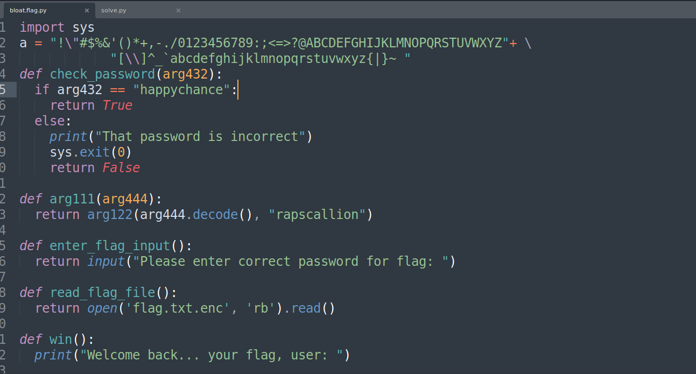

# bloat.py - CTF Challenge Writeup

## Challenge Information
- **Name**: bloat.py
- **Points**: 200
- **Category**: Reverse Engineering

## Objective
The objective of the "bloat.py" CTF challenge is to test your reverse engineering skills, specifically in dealing with heavily obfuscated code. In this challenge, you are provided with a Python script that is deeply obfuscated. Your goal is to deobfuscate the code to obtain a password. Once you have the password, you can use it to access the flag. This challenge encourages participants to practice their code analysis and deobfuscation skills.

## Solution
To successfully complete the "bloat.py" challenge, I followed these steps:

1. **Analyzing the Obfuscated Script**:
   - The provided Python script is heavily obfuscated, making it challenging to discern its actual functionality.
   - The primary goal is to deobfuscate the code to reveal a password that can be used to access the flag.

2. **Password Identification**:
   - To simplify the challenge, you only need to deobfuscate the password. In this case, the password is "happychance."
   - Once you have the password, you can use it to find the flag.


       

3. **Deobfuscating the Entire Script** (Optional)**:
   - For the sake of learning and thoroughness, you can choose to deobfuscate the entire Python script. This process allows you to understand how the code works and explore the logic.


        

4. **Alternative Approach: Finding XOR Key**:
   - Another approach to solving the challenge is to identify the XOR key used in the obfuscation process and decode the script yourself.


      
      ```python
         from pwn import * 

         with open("flag.txt.enc", "rb") as file: 
            content = file.read()

         print(xor(content, b"rapscallion").decode())
      ```

By deobfuscating the provided Python script, you can extract the password "happychance," which allows you to access the flag. Additionally, you can explore the code for a deeper understanding of its functionality.

## Flag
The flag for this challenge is in the format `picoCTF{XXXXXXXXXX}`. Participants should follow the provided steps to deobfuscate the script, find the password, and use it to access the flag. Alternatively, they can explore the code to learn more about its operation and discover other possible approaches to solve the challenge.

I hope this writeup provides valuable insights into how to approach and solve the "bloat.py" CTF challenge. If you have any more questions or need further assistance, please feel free to ask.
