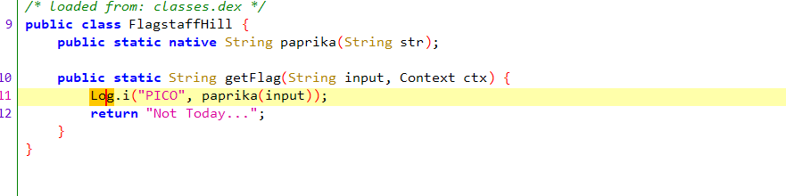
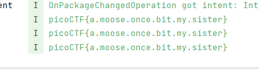

# droids0 CTF Challenge Writeup

## Challenge Information
- **Name**: droids0
- **Points**: 300
- **Category**: Reverse Engineering

## Objective
The objective of the "droids0" CTF challenge in the Reverse Engineering category is to analyze an APK file and extract the flag by interacting with the application.

## Solution
To successfully complete the "droids0" CTF challenge, I followed these steps:

1. **Using jadx-gui for Reverse Engineering**:
   - Given an APK file, I employed jadx-gui, a powerful tool for reverse engineering Android applications.

2. **Analyzing the Source Code**:
   - In the source code, I observed the use of `Log.i()` for logging information.
   - This indicated that the application was logging certain events or data.

        

3. **Inspecting Logging Output**:
   - To understand the application's behavior, I opened the APK in an Android simulator and monitored the logging output.
   - Interacting with the application, I looked for any significant information logged.

4. **Identifying Flag Logging Event**:
   - Upon interacting with the application, I discovered that clicking a specific button triggered the logging of the flag.

5. **Extracting the Flag from Logcat**:
   - The flag was revealed in the logcat output, providing the necessary information to complete the challenge.

        

