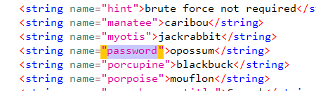
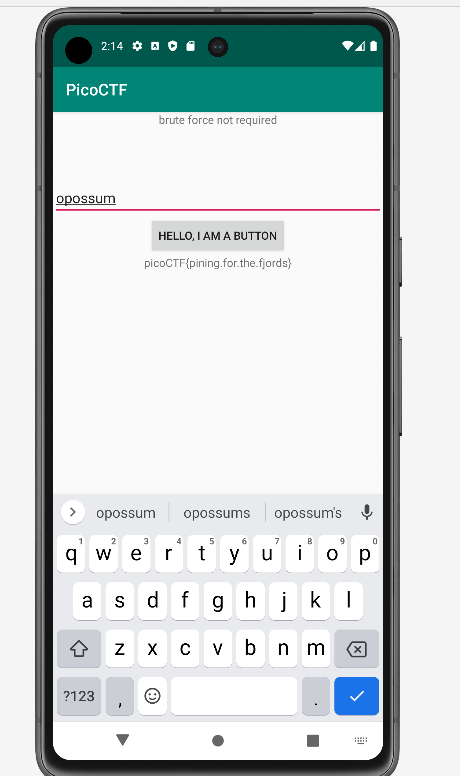

# droids1 CTF Challenge Writeup

## Challenge Information
- **Name**: droids1
- **Points**: 350
- **Category**: Reverse Engineering

## Objective
The objective of the "droids1" CTF challenge in the Reverse Engineering category is to identify a password by analyzing the source code of an Android application and use it to obtain the flag.

## Solution
To successfully complete the "droids1" CTF challenge, I followed these steps:

1. **Analyzing Source Code with jadx-gui**:
   - Utilizing jadx-gui, I examined the source code of the Android application provided for the challenge.

2. **Identifying Password Check**:
   - In the source code, it was apparent that the application was looking for a password.
   - Understanding the mechanism of this password check was crucial for solving the challenge.

3. **Searching for Hard-Coded Password in strings.xml**:
   - Knowing that the password was hard-coded, I focused on searching for it in the resources directory.
   - The likely location for such values is often in `res/values/strings.xml`.

        

4. **Locating the Password**:
   - After navigating to `res/values/strings.xml`, I found the hard-coded password.

5. **Entering the Password**:
   - With the identified password in hand, I entered it as prompted by the application.

        