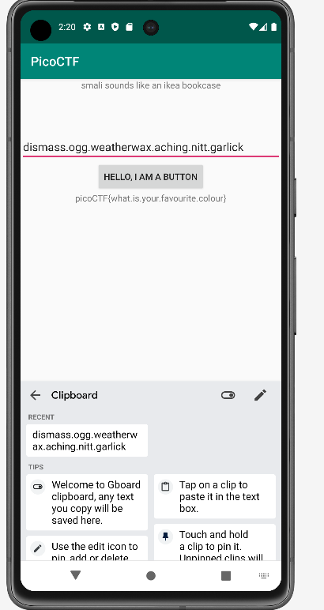

# droids2 CTF Challenge Writeup

## Challenge Information
- **Name**: droids2
- **Points**: 400
- **Category**: Reverse Engineering

## Objective
The objective of the "droids2" CTF challenge in the Reverse Engineering category is to analyze an APK file, understand its array operations, and derive the password necessary to obtain the flag.

## Solution
To successfully complete the "droids2" CTF challenge, I followed these steps:

1. **Analyzing Array Operations with jadx-gui**:
   - Open the provided APK file in jadx-gui to examine the source code.

2. **Identifying Array Operations**:
   - Observe the array operations being performed in the source code.
   - Understand the logic behind these operations, as they likely play a role in generating the required password.

        

3. **Performing Array Operations**:
   - Replicate the array operations manually or use a scripting language to simulate the operations performed by the application.
   - By doing so, you aim to derive the password generated through these array manipulations.

4. **Finding the Password**:
   - Analyze the results of the array operations to obtain the password required for the flag.

5. **Entering the Password**:
   - Once the password is derived, enter it as prompted by the application.

        