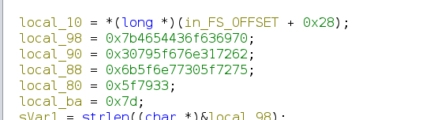

# Keygenme - CTF Challenge Writeup

## Challenge Information
- **Name**: Keygenme
- **Points**: 400
- **Category**: Reverse Engineering

## Objective
The objective of the "Keygenme" CTF challenge is to demonstrate your reverse engineering skills. In this challenge, you are provided with a stripped binary, and your task is to reverse engineer it to extract the flag. This challenge aims to teach participants how to analyze and manipulate binaries to uncover the hidden flag.

## Solution
To successfully complete the "Keygenme" challenge, I followed these steps:

1. **Binary Analysis with Ghidra**:
   - Given a stripped binary, I decided to use Ghidra, a popular reverse engineering tool, to analyze the binary.
   - Using Ghidra's disassembler and decompiler, I began exploring the binary's functionality.

2. **Identifying Part of the Flag**:
   - During the analysis in Ghidra, I was able to identify and extract a portion of the flag.

     
    

3. **Runtime Modification with IDA**:
   - Although I had part of the flag, I was missing the rest of it. To fill in the gaps, I turned to IDA, another reverse engineering tool.
   - In IDA, I modified the binary in runtime to view the sections of the flag that were not initially visible.

4. **Deciphering Flag Operations**:
   - By observing the binary's operations and logic in IDA, I successfully extracted the numbers required for the final section of the flag.

    
    
    

5. **Flag Reconstruction**:
   - Armed with all the flag components, I reconstructed the flag in the provided format: `picoCTF{XXXXXXXXXX}`.

     

By utilizing Ghidra for initial analysis and IDA for runtime modification and in-depth exploration, I was able to reverse engineer the "Keygenme" binary and extract the flag.

## Flag
The flag for this challenge is in the format `picoCTF{XXXXXXXXXX}`. Participants should follow the provided steps to analyze and manipulate the binary to obtain the hidden flag.

I hope this writeup provides insight into how to approach and solve the "Keygenme" CTF challenge, showcasing the power of reverse engineering. If you have any more questions or need further assistance, please feel free to ask.
