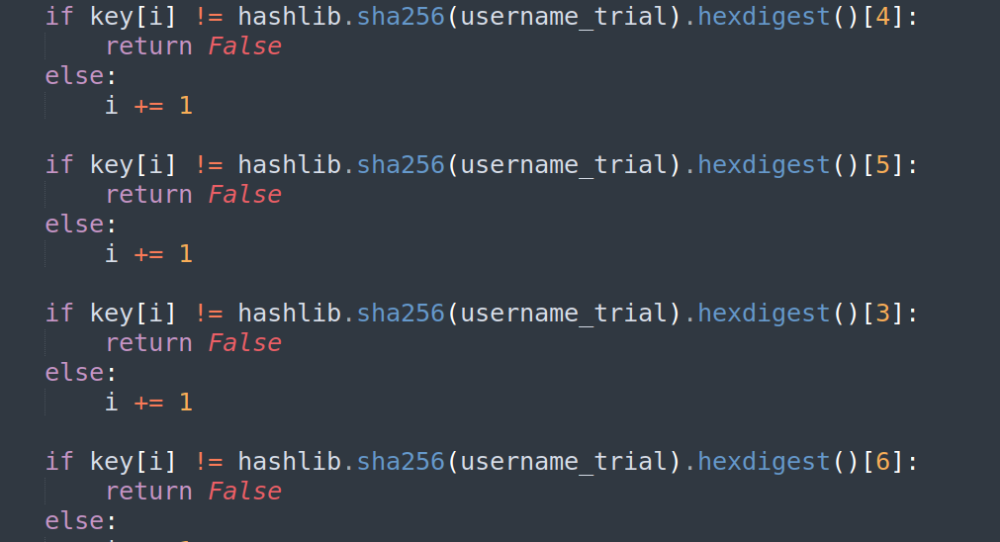

# keygenme-py - Reverse Engineering Challenge

## Basic Information
**Name:** keygenme-py  
**Category:** Reverse Engineering  
**Points:** 30

## Objective

The "keygenme-py" challenge falls under the category of reverse engineering. Your objective is to find the flag hidden within a provided Python file. The flag is dynamically generated using a hashlib-based formula, which you are given. Your task is to use this formula to generate the flag.

## Solution

To successfully complete the "keygenme-py" challenge, follow these steps:

1. **Analyze the Given Python File:**
   - Begin by examining the provided Python file. It contains the logic and code responsible for generating the flag.

2. **Understanding the Flag Generation Formula:**
   - The flag is created dynamically using a hashlib-based formula. Take the time to understand the formula and how the flag is generated.


3. **Create a Separate Script:**
   - I created a separate Python script that replicates the same logic, but this time, tell me the flag.
      ```python
      import hashlib
      from cryptography.fernet import Fernet
      import base64

      username_trial = b"PRITCHARD"

      key_part_static1_trial = "picoCTF{1n_7h3_|<3y_of_"
      key_part_dynamic1_trial = "xxxxxxxx"
      key_part_static2_trial = "}"

      first_letter = hashlib.sha256(username_trial).hexdigest()[4]
      second_letter = hashlib.sha256(username_trial).hexdigest()[5]
      third_letter = hashlib.sha256(username_trial).hexdigest()[3]
      fourth_letter = hashlib.sha256(username_trial).hexdigest()[6]
      fifth_letter = hashlib.sha256(username_trial).hexdigest()[2]
      sixth_letter = hashlib.sha256(username_trial).hexdigest()[7]
      seventh_letter = hashlib.sha256(username_trial).hexdigest()[1]
      eighth_letter = hashlib.sha256(username_trial).hexdigest()[8]

      print(f"{key_part_static1_trial}{first_letter}{second_letter}{third_letter}{fourth_letter}{fifth_letter}{sixth_letter}{seventh_letter}{eighth_letter}{key_part_static2_trial}")
      ```

4. **Generate the Flag:**
   - Execute your Python script, and it should produce the flag according to the hashlib-based formula provided in the challenge.

5. **Flag Discovery:**
   - By following the provided formula and generating the flag using your separate script, you will discover the hidden flag.

Flag: picoCTF{XXXXXXXXXX}

**Challenge Solved**  
