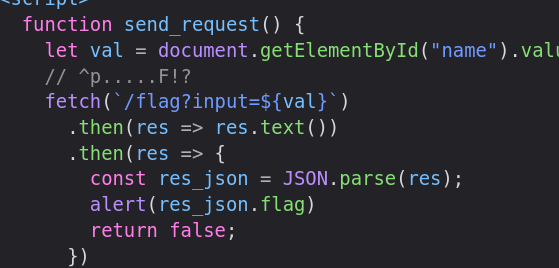
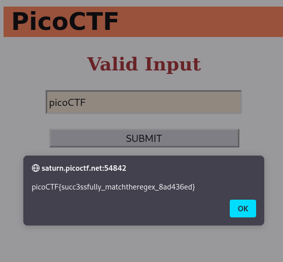

# MatchTheRegex - CTF Challenge Writeup

## Challenge Information
- **Name**: MatchTheRegex
- **Points**: 100
- **Category**: Web Exploitation

## Objective
The objective of the "MatchTheRegex" CTF challenge is to identify a matching input against a provided regular expression and extract the flag.

## Solution
To successfully solve the "MatchTheRegex" challenge, I followed these steps:

1. **Source Code Analysis**:
   - Examined the source code to identify a specific regular expression pattern utilized within the challenge.
   - The regular expression served as the basis for validating input and finding a match.

      

2. **Utilizing debuggex.com for Regular Expression Debugging**:
   - Employed the online tool debuggex.com, which facilitates the debugging and testing of regular expressions.
   - Utilized the debugging features to experiment with various inputs and analyze how they matched against the provided regular expression.

      

3. **Finding the Matching Input**:
   - Through trial and error on debuggex.com, identified an input that matched the defined regular expression pattern.
   - The successful input would satisfy the criteria of the regular expression and trigger a match.

4. **Flag Extraction**:
   - Once a matching input was found and successfully triggered the regular expression match, the flag was revealed.

      

## Flag
The flag for the "MatchTheRegex" challenge is `picoCTF{XXXXXXXXXX}`. Participants should analyze the provided regular expression, debug it using debuggex.com or similar tools, and find an input that matches the defined pattern to extract the flag.

This writeup aims to guide individuals through the process of understanding and finding a matching input against a specified regular expression to obtain the flag in the Web Exploitation category. For further assistance or clarification, feel free to ask.
