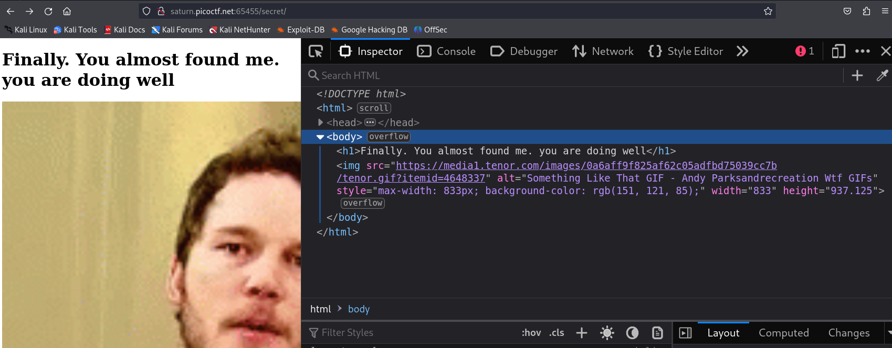

# Secrets CTF Challenge Writeup

## Challenge Information
- **Name**: Secrets
- **Points**: 200
- **Category**: Web Exploitation

## Objective
The objective of the "Secrets" CTF challenge in the Web Exploitation category is to navigate through web pages, discover hidden directories, and ultimately locate the flag.

## Solution
To successfully complete the "Secrets" CTF challenge, I followed these steps:

1. **Checking robots.txt**:
   - Initially, I considered the possibility of the flag being hidden in robots.txt, but upon inspection, robots.txt was not present.

      

2. **Exploring Web Pages**:
   - To proceed, I explored various web pages, keeping an eye out for any hints or hidden directories.
   - Eventually, I discovered an image that hinted at a directory named 'secret,' aligning with the challenge's name.

      

3. **Accessing the 'secret' Directory**:
   - Upon accessing the 'secret' directory, it seemed like progress was being made.

4. **Examining Source Code for Hidden Directories**:
   - Continuing to inspect the source code, another directory named 'hidden' was identified.
   - Navigating to this directory, I found a login page.

      
      

5. **Analyzing Source Code of the Login Page**:
   - Examining the source code of the login page, I discovered yet another hidden directory named 'superhidden.'

6. **Exploring 'superhidden' for the Flag**:
   - Accessing the 'superhidden' directory, I found the flag hidden within the CSS of the page.

      