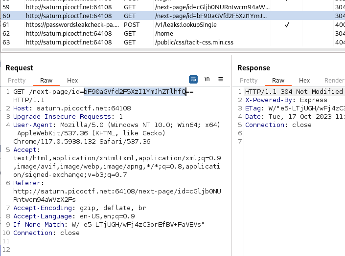

# findme - Web Exploitation Challenge

## Basic Information
**Name:** findme  
**Category:** Web Exploitation  
**Points:** 100

## Objective

The "findme" web exploitation challenge required me to discover the flag hidden within a web application by analyzing its behavior and capturing the necessary data.

## Solution

Here's how I approached and solved the "findme" web exploitation challenge:

1. **Login with Provided Credentials:**
   - The challenge provided me with login credentials. I used these credentials to log in to the web application.

2. **Page Load Delay:**
   - After logging in, I noticed that the page took some time to load, which indicated that there might be some behind-the-scenes processes or redirects happening.

3. **Use Burp Suite for Intercepting Traffic:**
   - To investigate the page's behavior and capture any hidden information, I used Burp Suite, a popular web application security testing tool.

4. **Capture and Analyze Redirects:**
   - With Burp Suite configured to intercept the traffic between my browser and the web application, I triggered the actions on the page that seemed to be causing the redirects.

5. **Decode Base64 in Redirects:**
   - As I captured and analyzed the redirects, I found that the flag was hidden within these redirects, encoded in Base64.

6. **Flag Discovery:**
   - After decoding the Base64 data from the redirects, I was able to retrieve the flag required to complete the challenge.

Flag: picoCTF{XXXXXXXXXX}

**Challenge Solved**  
